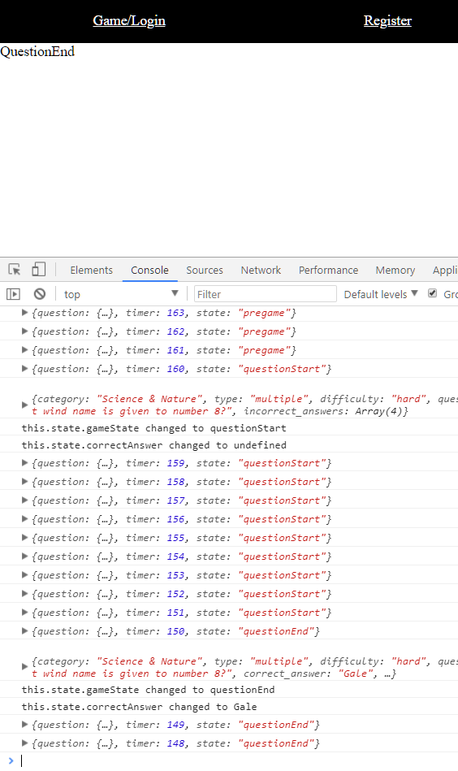

# QuizIt
QuizIt! Trivia Game

## Welcome to the React Development branch!

You are here because you're awesome and you're not lame like those losers in the back end are!

To run a react development environment for this branch run the following in the root Quizit directory to install all the dependencies:
```
yarn installDeps
```

To start up your server and react-client, run the following comman in the root Quizit directory:
```
yarn start-reactDev
```

Once the page loads, follow these steps:

1. Start mongod in a separate terminal
2. Register if you don't have a username/password registered
3. Login with your username and password
4. Open the console and see the magic!
    * FYI the game starts 10 seconds after the server is up and running.




Currently, Home.js is properly setting its own state based on the data being sent from the server every second. The next tasks involve rendering these elements in a universal container for all four main components.

The code that makes this happen in Home.js is:
``` Javascript
componentDidMount(){
  socket.on('message', (msg) => {
    console.log(msg);
  });
  socket.on('roomState', (msg) => {
    console.log(msg);
    //Sets gameState based on response. Sets timer. Sets questions and correctAnswer when applicable.
    this.setState({timer:msg.timer});
    if(this.state.gameState !== msg.state){
      this.setState({gameState:msg.state,question:msg.question,correctAnswer:msg.question.correct_answer}, ()=>{
        console.log(this.state.question);
        console.log("this.state.gameState changed to "+this.state.gameState);
        console.log("this.state.correctAnswer changed to "+this.state.correctAnswer);
      })
    }
  });
}
```

These four components of gameState are:

1. Pregame
	* Display something, idk. Something about the game. The logo. Kittens.
2. QuestionStart
	* Display the question with the choices selectable.
3. QuestionEnd
	* Display the question with the correct answer in green, and if you got it wrong, the wrong answer in red.
4. RoundEnd
	* Display the number of questions you got right along with a leaderboard

Ideally, we want all four of the gameState components to be in a stylized container that does not change between the rounds. Only the components inside this container will change. We also want to use react-bootstrap. After we get the questions rendering, we need to convert register and login into modals.

Right now, the server will only send 1 full round of questions before being stuck forever sending a negative timer and roundEnd. To counteract this, open server-reactDev and just press ctrl+s to force nodemon to refresh.